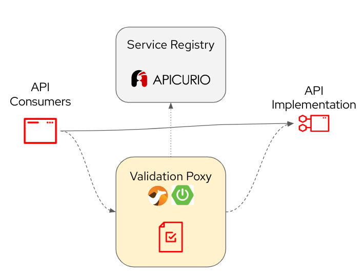

# OpenAPI validator


> **WARNING:**
This is just an experimental project developed for a demo! It's currently under development and lack in testing and functionalities. Anyone are welcome to improve it or propose new features 
## Intro

This tool allows the validation at runtime of the API requests responses according to the OpenAPI specs through an HTTP Proxy.  

There are several tools that can validate an OpenAPI specification, but there are no many options to ensure that the API contracts are honoured by the API we are developing.

This tool make sure that the API requests and responses are valid according to the OpenAPI specification of the API.

The `openapi-request-response-validator` is a SpringBoot and Camel(Java) application implementing an HTTP Proxy for transparent validation of Request/Response against OpenAPI specification. The OpenAPI specs can be provided using a list of URL in `application.properties` file or any other method supported by SpringBoot configuration mechanism. For example, they can be stored in an [Apicurio Registry](https://www.apicur.io/registry/)

## How does it work?



A validation error will result in a `HTTP/1.1 400 Bad Request` with a JSON array of error messages as response body.

## How to run

Configure your OpenAPI specs locations in `application.properties` as a list of:

```
provider.schemasLocations.<OpenApiSchemaKey>=<URL>
```
Eg:
```
provider.schemasLocations.MyApiSpec=file://MyApiSpec.json
```

Run the application with `mvn spring-boot:run` (listening on port 8080 by default)

Then you can curl your service using the validation proxy:
```
curl -v -H "OpenApiSchemaKey: <OpenApiSchemaKey>" --proxy "http://localhost:8080" '<myservicehostendpoint>' | json_reformat json_reformat
```

`OpenApiSchemaKey` header value need to match the configured ones in `application.properties` in order to select the proper OpenAPI spec.

As of today validation happens only on the `request`.

---
Using [Atlassian Swagger Validator](https://bitbucket.org/atlassian/swagger-request-validator/), [Camel](https://camel.apache.org/) 
and [SpringBoot](https://spring.io/projects/spring-boot/)

Inspired by the excellent work by [Beppe Catanese](https://github.com/gcatanese/openapi-request-response-validation) and adapted as HTTP Proxy.